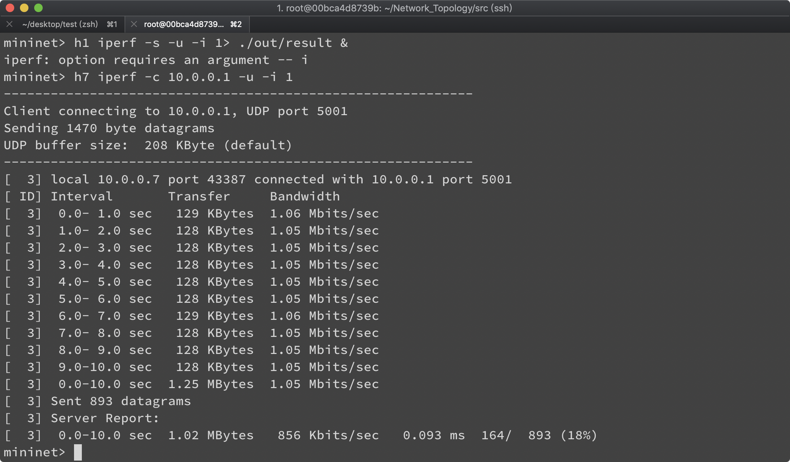
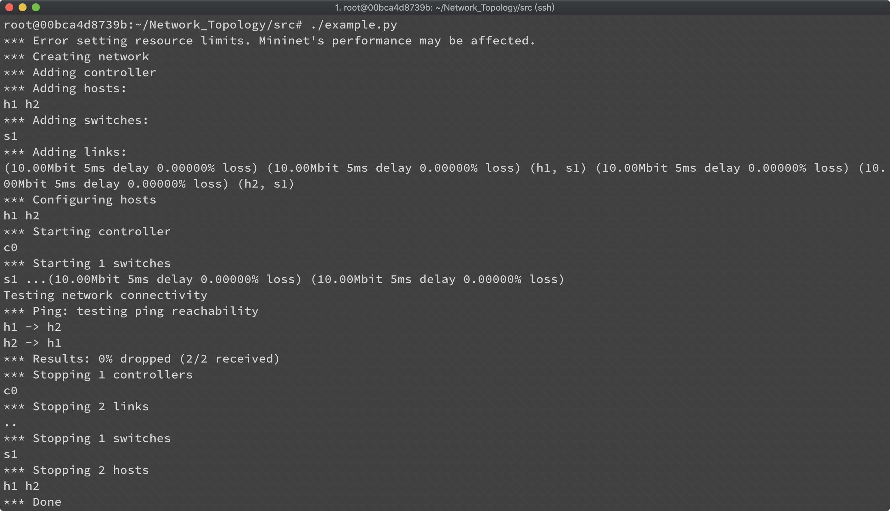

# Network Topology with Mininet

This repository is lab for NCTU course "Introduction to Computer Networks 2018".

---
## Abstract

In this lab, we are going to write a Python program which can generate a network topology using Mininet and use iPerf to measure the bandwidth of the topology.

---
## Objectives

1. Learn how to create a network topology with Mininet
2. Learn how to measure the bandwidth in your network topology with iPerf

---
## Execution

> TODO: 
> * Describe how to execute your program  
	1. Open my terminal and login in my container using SSH.       
	2. Change the recent directory into /Network_Topology/src/   
	`cd /root/Network_Topology/src/`    
	3. Change to the executable mode of topology.py   
	`chmod +x topology.py`    
	4. Run topology.py  
	`./topology.py`    
> * Show the screenshot of using iPerf command in Mininet
	

---
## Description

### Mininet API in Python

> TODO:
> * Describe the meaning of Mininet API in Python you used in detail  
	- You need to include several modules from mininet, each of them have different contribution on building  topology.  

	#Network emulation with hosts spawned in network namespaces. 
	from mininet.net import Mininet
	
	#Data center network representation for structured multi-trees.
	from mininet.topo import Topo
	
	#Open vSwitch controller
	from mininet.node import OVSController
	
	#Link with symmetric TC interfaces configured via opts
	from mininet.link import TCLink
	
	#Dump every hosts’ and switches’ connections
	from mininet.util import dumpNodeConnections
	
	#Set Mininet's default output level
	from mininet.log import setLogLevel
	
	#Simple command-line interface to talk to nodes
	from mininet.cli import CLI
	

### iPerf Commands

> TODO:
> * Describe the meaning of iPerf command you used in detail  
	`h1 iperf -s -u -i 1 > ./out/result &`   
	1. -s, --server             run in server mode  
	2. -u, --udp                use UDP rather than TCP  
	3. -i, --interval  #        seconds between periodic bandwidth reports  
	(-i 1: display the data every one seconds)  
	`h7 iperf -c 10.0.0.1 -u –i 1`     
	1. -c, --client    <host>   run in client mode, connecting to <host>  
	(10.0.0.1 : the ip of server)  
	2. -u, --udp                use UDP rather than TCP  
	3. -i, --interval  #        seconds between periodic bandwidth reports  
	(-i 1: display the data every one seconds)  
	
### Tasks

> TODO:
> * Describe how you finish this work step-by-step in detail

1. **Environment Setup**
	1. Join the lab on GitHub Classroom and get the initial repository. ([https://github.com/nctucn](https://github.com/nctucn))  
	2. Login to my container using SSH. (I'm using Mac)  
	`ssh root@140.113.195.69 -p 16328
	 Password: cn2018`  
	3. Clone my GitHub repository.  
	`git clone https://github.com/nctucn/lab2-sheeeep914.git Network_Topology`    
	4. After cloning, there will be a folder **"Network_Topology"** in my container.   
	5. Run Mininet for testing.  
	`sudo mn`   
2. **Example of Mininet**
	1. Run example.py   
	```
	#Change the directory into /Network_Topology/src/
	cd /root/Network_Topology/src/
	
	# Change to the executable mode of example.py
	chmod +x example.py
	
	# Run example code (example.py)
	./example.py
	```
	2. Result after running example.py  
	
	

3. **Topology Generator**
	1. View the topology picture I'm going to generate (topo2.png)    
	2. Write a python program (topology.py) to generate a network topology for Mininet    
		- define a function build in the class MyTopo `def build(self):`  
		- Create hosts and switches `.addSwitch() .addHost()`  
		- Construct links `.addLink(switch/host, switch/host, bd, delay, loss)`  
		- Create and test a custom network `def simpleTest()`  

4. **Measurement**
	1. Using **iPerf commands** to measure the topology
	(these commands below will dump the result of iPerf’s measurement into the file **result**	/Network_Topology/src/out/result)    
	```
	h1 iperf -s -u -i 1 > ./out/result &
	h7 iperf -c 10.0.0.1 -u –i 1
	```
	2. The expected result from my topology.py  
	
---
## References

> TODO: 
> * Please add your references in the following  

* **Mininet**
    * [Mininet Walkthrough](http://mininet.org/walkthrough/)
    * [Introduction to Mininet](https://github.com/mininet/mininet/wiki/Introduction-to-Mininet)
    * [Mininet Python API Reference Manual](http://mininet.org/api/annotated.html)
    * [A Beginner's Guide to Mininet](https://opensourceforu.com/2017/04/beginners-guide-mininet/)
    * [GitHub/OSE-Lab - 熟悉如何使用 Mininet](https://github.com/OSE-Lab/Learning-SDN/blob/master/Mininet/README.md)
    * [菸酒生的記事本 – Mininet 筆記](https://blog.laszlo.tw/?p=81)
    * [Hwchiu Learning Note – 手把手打造仿 mininet 網路](https://hwchiu.com/setup-mininet-like-environment.html)
    * [阿寬的實驗室 – Mininet 指令介紹](https://ting-kuan.blog/2017/11/09/%E3%80%90mininet%E6%8C%87%E4%BB%A4%E4%BB%8B%E7%B4%B9%E3%80%91/)
    * [Mininet 學習指南](https://www.sdnlab.com/11495.html)
* **Python**
    * [Python 2.7.15 Standard Library](https://docs.python.org/2/library/index.html)
    * [Python Tutorial - Tutorialspoint](https://www.tutorialspoint.com/python/)
* **Others**
    * [iPerf3 User Documentation](https://iperf.fr/iperf-doc.php#3doc)
    * [Cheat Sheet of Markdown Syntax](https://www.markdownguide.org/cheat-sheet)
    * [Vim Tutorial – Tutorialspoint](https://www.tutorialspoint.com/vim/index.htm)
    * [鳥哥的 Linux 私房菜 – 第九章、vim 程式編輯器](http://linux.vbird.org/linux_basic/0310vi.php)

---
## Contributors

> TODO:
> * Please replace "YOUR_NAME" and "YOUR_GITHUB_LINK" into yours

* [Yu-Hsin Yang](https://github.com/sheeeep914)
* [David Lu](https://github.com/yungshenglu)

---
## License

GNU GENERAL PUBLIC LICENSE Version 3
